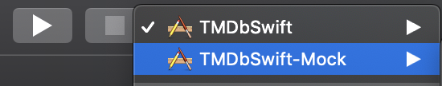

# TMDbSwift
iOS Application that shows the list of upcoming movies from The Movie Database (TMDb) database

The application is designed with 
`MVP + Coordinators + Clean Architecture`.

The application is covered by unit tests.

The architecture was divided with the following layers: 

* **Presentation Layer:** Coordinators, Factories, Presenters, ViewControllers, TableView and Cells
* **Domain Layer:** Interactors and Repositories
* **Data layer:** API and Services for network requests

Frameworks adopted:

* **Quick/Nimble:** Used to implement unit tests in a Behavior-driven style
* **Moya:** Used to handle network requests
* **RXSwift:** Used to lint code and apply code format

## Local Pipeline

A local Continuous Integration pipeline was built to improve the code quality of the project. 
The automated commands are placed in `Makefile`
You just need to run the command `make check`.

It runs the following steps in a orderly manner:

`Clean Workspace  --> RXSwift Lint  --> Build Workspace --> Unit Testing  --> UI Testing`

If one of these steps fail, the pipeline will fail as a whole. And, the developer must fix the highlighted problems.

**Ps:** If you don't have some dependencies yet installed. Probably, `make check` command will fail. 

So, just run the command:

`make setup` 

It will install `xcpretty` and will execute `pod install`.

## Mock

In order to have the network mocked up you need to run the application with the pre-configured 'Mock' build scheme, as you can see in the image below:

If you want to change the mocked results, just update with your own responses the files below:

* GenreMockService
* MovieMockService

## TODO: 
* Unit test the factory classes: SceneFactory and CoordinatorFactory
* Implement UI tests with mock environment to ensure the whole flow is working properly
* Fetch more movies when when table view has finished scrolling
